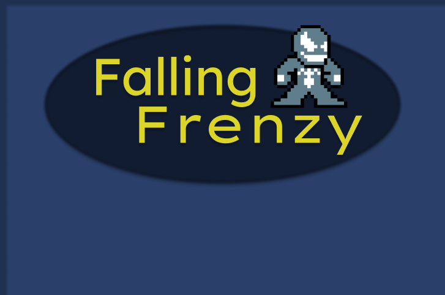
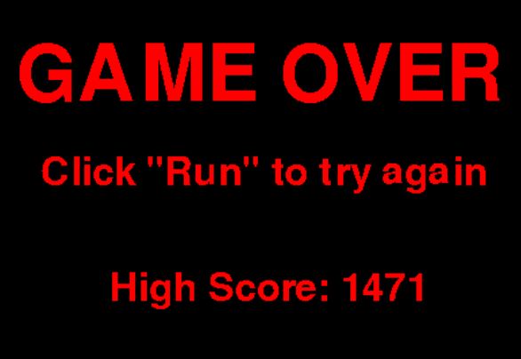
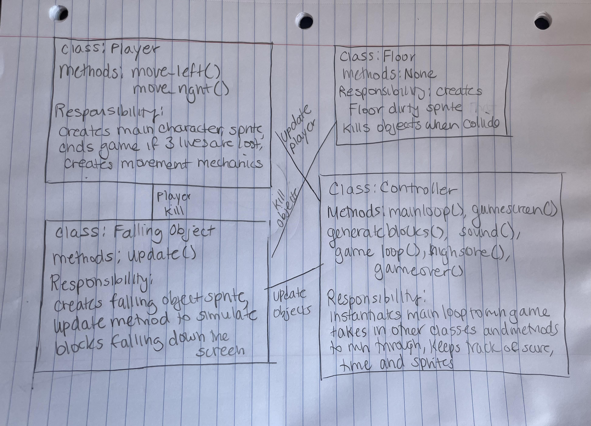

:warning: Everything between << >> needs to be replaced (remove << >> after replacing)
# CS110 Project Proposal
# Falling Frenzy
## CS 110 Final Project
### Spring, 2022
### [Assignment Description](https://docs.google.com/document/d/1H4R6yLL7som1lglyXWZ04RvTp_RvRFCCBn6sqv-82ps/edit#)

[bucs110a0spring22/final-project-james-max-grace](#) 

[(https://docs.google.com/presentation/d/1bFXf-G2x1juwS3Nr9xQ-eJRjKXZIUkDN0U5asCTSxJk/edit#slide=id.p)](#) 

### Team: Goon Squad
#### Grace Barbara, Max Argenson, James Brone

***

## Project Description *(Software Lead)*

Our project is a simple yet fun game where the player moves from left to right on the screen in order to avoid falling blocks. The player has three lives, and each collision with a block takes away one life. A timer is also implemented in order to display how long the player has survived. After the player dies the high score will be displayed, as well as instructions to restart.
***    

## User Interface Design *(Front End Specialist)*

* << Main Menu Start Screen >>
  * The first screen seen will be the game menu screen. This screen contains the name of the game, what the character looks like, and instructions to start/play the game. If the user hits the 'space' key, the game will run. Once the game is running, if the user clicks on the right key, the character will move right, and if the user clicks on the left key, the character will move left. 
  * 
* << Game Screen >>
  * This screen is accessed when the user clicks the space button in the main menu start screen. On this screen, the character can move left/right by using the right of left arrow keys. There would also be objects spawning in at random x positions at the top of the screen. These object will fall to the bottom of the screen. Once the player dies, they will be sent to the game over screen
  * 
* << Game Over Screen >>
  * This screen is accessed when the character dies. A background displaying "Game Over" will show. The user can click on the green "Run" button to restart the game. A message will be displayed showing how to do that
  * 
***        

## Program Design *(Backend Specialist)*

* Non-Standard libraries
    * Pygame- Pygame is a free set of Python modules designed for writing video games. Pygame adds functionality on top of the excellent SDL library. This allows you to create fully featured games and multimedia programs in the python language.
        * (https://www.pygame.org/docs/)
* Class Interface Design
         
    * This does not need to be overly detailed, but should show how your code fits into the Model/View/Controller paradigm.
* Classes
    * Player-A class that defines the main character in the game. This character is a non-moving image that appears to be moving when looping through the game loop and redrawing its position in each frame. The character is able to move left and right to avoid collisions with the falling blocks.
    * Falling Objects-A class that defines the obstacles that fall from the top of the screen. If the character and a falling object collide, the player loses health. If the objects and the player collide three times, the game ends.
    * Floor- A class that defines the floor dirty sprite into which the blocks that collide will be killed.
    * Controller-A class that utilizes each of the other classes in order to loop through a main loop and game loop to run the game. Also contains other necessary methods for running such as generate_blocks and 

## Project Structure *(Software Lead)*

The Project is broken down into the following file structure:
* main.py
* src
    * <all of your python files should go here>
* assets
    * <all of your media, i.e. images, font files, etc, should go here)
* etc
    * <This is a catch all folder for things that are not part of your project, but you want to keep with your project. Your demo video should go here.>

***

## Tasks and Responsibilities

### Software Lead - James Brone

I worked as software lead/integration specialist by ensuring dryness and compatability within the code. I also ensured that final game matched up with parameters established in the ATP, and collaborated on various classes. I was inolved with the beginning discussion of what game we should make as well.

### Front End Specialist - Max Argenson

Front-end lead conducted significant research on the controller class and the GUI. I had to do research on how to transition between the three different states (Menu screen, Game screen, and Game Over screen) and how to modify them to add this such as an image as a background or text for example. I worked with the Back end Specialist to implement sprites such as the character and the falling objects. The controller is where most of the code is found and where the GUI is created

### Back End Specialist - Grace Barbara

As back end specialist, I helped with the modeling portion of the work by coding the main classes within the game and multiple methods such as the move and update methods. I had to research the methods of sprites in pygame and their different functionalities. I worked together with the front end specialist to implement these classes into the controller and make sure that all varible names were compatible in order to create the game. I also contributed to designing and coding the controller.

## Testing *(Software Lead)*

*  The code was tested on a case-by-case basis. Whenever a bug would appear, or whenever a feature did not work as intended, the code would be examined at the line where the error occured or if there was no error message, where the bug was most likely to have occured. Before the final project was submitted, all features were examined and tested in order to establish that they had been proerly implemented and that they matched with the API. Additionally, the code was kept as dry as possible. 
   * ###### Example: When the timer feature was first implemented, the timer would display on the screen but the minutes would change at random intervals. Since the seconds and milliseconds worked, it was determined that the issue was most likely in the line of code that calculate the minutes. The calculations were changed to the correct ones for the minutes and the timer then worked as intended.

## ATP

| Step                  | Procedure     | Expected Results  | Actual Results |
| :----------------------:|:-------------:| :-----------------:| :--------------:|
|  1  | Press Run Button  | Main menu screen displays. |          |
|  2  | Click Space Bar to exit menu and begin game. | Main display screen ends and game screen appears. A timer, score count, player, and randomly generated blocks display on the screen. Blocks begin falling from the top of the screen and disappear once they reach the bottom. Timer starts at zero and continues counting up until player dies. Once all three lives are lost, a game over screen appears, the high score is sent to a file and displayed on the game over screen.|          |
|  3  | Press Right Arrow Button| Player moves a small increment to the right. |           |
|  4  | Press Left Arrow Button | Player moves a small increment to the left. |          |
|  5  | Hold down Right Arrow Button| Player moves continuously to the right as long as right arrow button remains pressed.  |
|  6  | Hold down Left Arrow Button| Player moves continuously to the left as long as left arrow button remains pressed.  |

